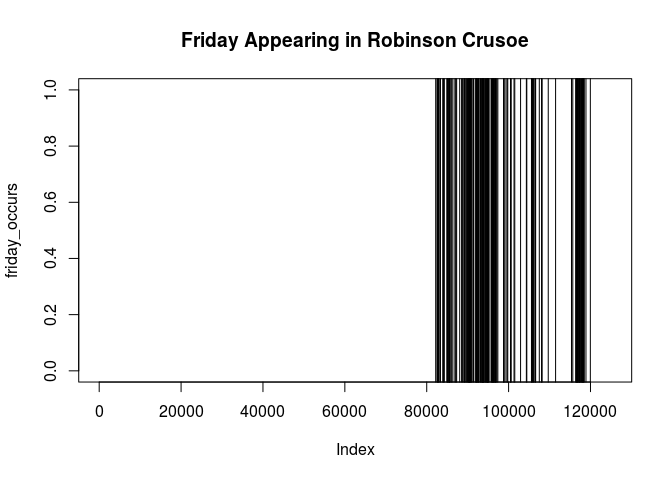
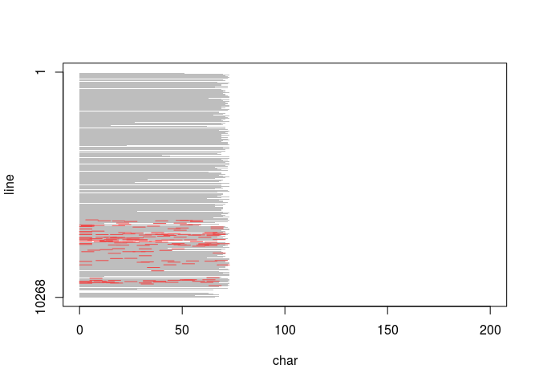

# README


# stringb

Convenient base R string handling.


## Status

*unstable* - in wild development with fuRiouS rEstRucturINg and biG biG pOKing

[](https://travis-ci.org/petermeissner/stringb)
[](https://codecov.io/gh/petermeissner/stringb/tree/master/R)
[](https://cran.r-project.org/package=stringb)


## Description

Base R already ships with string handling capabilities
    'out-of-the-box' but lacks streamlined function names and workflow.
    The stringi (stringr) package on the other hand has well named functions
    and allows for a streamlined workflow but adds further dependencies and
    regular expression interpretation between base R functions and stringi
    functions might differ. 
    

This packages aims at: 

- **no dependencies** except what comes with base-R
- writing **text handling functions as generics** so that methods for all kind of 
  structures containing text can be added 
- providing functions that allow for different character encodings 
- but rigorously defaulting to UTF-8 as expected input and default output 
  therby enhancing cross platform cooperation
- adding more power to general basic text handling functions by additional 
  options (e.g. the text_read() function allows to read in and tokenize text in 
  one function call)
- and insisting on a **flat interface** - meaning that all functionality should come from functions and plain parameters (in contrast to e.g. parameters that need specialised functions or funtions outputs to perform)
- adding further general text handling tools if there is a general enough 
  purpose for the added function(ality)
  

This package does not aim at:

- beeing fast (fast is good but will not be traded for the above listed aims - stringi might be your friend here)
- beeing ultimativly compatible (compatible is good but again will not be traded for the above listed aims - again stringi might be your solution in that case)


## Contribution

Note, that this package uses a Contributor Code of Conduct. By participating in this project you agree to abide by its terms: http://contributor-covenant.org/version/1/0/0/ (basically this should be a place were people get along with each other respectful and nice because it's simply more fun that way for everybody)

Contributions are very much welcome, e.g. in the form of:

- **typo fixing** ([edit file directly on Github](https://help.github.com/articles/editing-files-in-another-user-s-repository/))
- **bug reporting** (file an [issue](https://guides.github.com/features/issues/) - after having searched if the issue came up before - as - if possible - [minimal reproducable example](http://stackoverflow.com/help/mcve))
- **extending help files** (e.g. [edit the respective files directly on Github](https://help.github.com/articles/editing-files-in-another-user-s-repository/) or [fork the package](https://help.github.com/articles/fork-a-repo/) and later on make a [pull request](https://help.github.com/articles/using-pull-requests/); note, that the package use [roxygen2](http://r-pkgs.had.co.nz/man.html) for easing documentation)
- **writing example** (e.g. [edit the respective files directly on Github](https://help.github.com/articles/editing-files-in-another-user-s-repository/) or [fork the package](https://help.github.com/articles/fork-a-repo/) and later on make a [pull request](https://help.github.com/articles/using-pull-requests/); note, that the package use [roxygen2](http://r-pkgs.had.co.nz/man.html) for easing documentation)
- **vignette writing** (file an [issue](https://guides.github.com/features/issues/) first so that we can discuss htings than [fork the package](https://help.github.com/articles/fork-a-repo/) and later on make a [pull request](https://help.github.com/articles/using-pull-requests/))
- **test writing** (have a look at the [test coverage](https://codecov.io/gh/petermeissner/stringb/tree/master/R) than [fork the package](https://help.github.com/articles/fork-a-repo/) and later on make a [pull request](https://help.github.com/articles/using-pull-requests/))
- **feature suggestions** (file an [issue](https://guides.github.com/features/issues/) describing the idea, why this is important, possible alternative solutions and an example)
- **general discussion** of approach and or implementation  (file an [issue](https://guides.github.com/features/issues/))
- implementation **improvements** (file an [issue](https://guides.github.com/features/issues/) naming whats to be improved, why and how)


## Installation


```r
devtools::install_github("petermeissner/stringb")
library(stringb)
```

## Function list


```r
library(stringb)
objects("package:stringb")
```

```
##  [1] "%..%"                   "%.%"                   
##  [3] "text_c"                 "text_collapse"         
##  [5] "text_count"             "text_delete"           
##  [7] "text_detect"            "text_dup"              
##  [9] "text_eval"              "text_extract"          
## [11] "text_extract_all"       "text_extract_group"    
## [13] "text_extract_group_all" "text_filter"           
## [15] "text_grep"              "text_grepl"            
## [17] "text_grepv"             "text_length"           
## [19] "text_locate"            "text_locate_all"       
## [21] "text_locate_group"      "text_nchar"            
## [23] "text_pad"               "text_read"             
## [25] "text_rep"               "text_replace"          
## [27] "text_replace_all"       "text_replace_group"    
## [29] "text_replace_locates"   "text_show"             
## [31] "text_snippet"           "text_split"            
## [33] "text_split_n"           "text_sub"              
## [35] "text_subset"            "text_tokenize"         
## [37] "text_tokenize_words"    "text_to_lower"         
## [39] "text_to_title_case"     "text_to_upper"         
## [41] "text_trim"              "text_which"            
## [43] "text_which_value"       "text_wrap"             
## [45] "text_write"
```

    

## Example Usage


```r
library(stringb)
(test_file <- stringb:::test_file("rc_1_ch1.txt")) # just a file accompanying the package to test things
```

```
## [1] "/home/peter/R/x86_64-pc-linux-gnu-library/3.3/stringb/testfiles/rc_1_ch1.txt"
```

```r
text_read( test_file, tokenize = "\\W", n=20)[67:79]
```

```
##  [1] "Project"   "Gutenberg" "License"   "included"  "with"     
##  [6] "this"      "eBook"     "or"        "online"    "at"       
## [11] "www"       "gutenberg" "org"
```

Although, text_read() is just a wrapper araound readLines() it has become more powerful, consistent and streamlined by (1) always producing UTF-8 encoded character vectors, (2) allowing the usage of all readLines() options - e.g. n, (3) and adding further useful functionality like on-the-fly-tokenization.


```r
library(stringb)
(test_file <- stringb:::test_file("rc_3.txt")) # just a file accompanying the package to test things
```

```
## [1] "/home/peter/R/x86_64-pc-linux-gnu-library/3.3/stringb/testfiles/rc_3.txt"
```

```r
text          <- text_read(test_file, tokenize = "\\W+")
friday_occurs <- text_detect(text, "FRIDAY", ignore.case=TRUE)

plot(friday_occurs, type = "n")
abline(v=which(friday_occurs))
title("Friday Appearing in Robinson Crusoe")
```

<!-- -->

Text_detect() is another example for a streamlined interface (easier to remeber than grepl) with all base-R whistles and bells still beeing there - almost all base-R pattern matching functions have the ignore.case options to make pattern matching case insensitive. 


```r
library(stringb)
(test_file <- stringb:::test_file("rc_3.txt")) # just a file accompanying the package to test things
```

```
## [1] "/home/peter/R/x86_64-pc-linux-gnu-library/3.3/stringb/testfiles/rc_3.txt"
```

```r
text          <- text_read(test_file)

plot(text, pattern="Friday", ignore.case=TRUE)
```

<!-- -->

A simple method to plot character vectors with pattern markup was added as well. 
    
    
    
    
    
    
    
    
    
